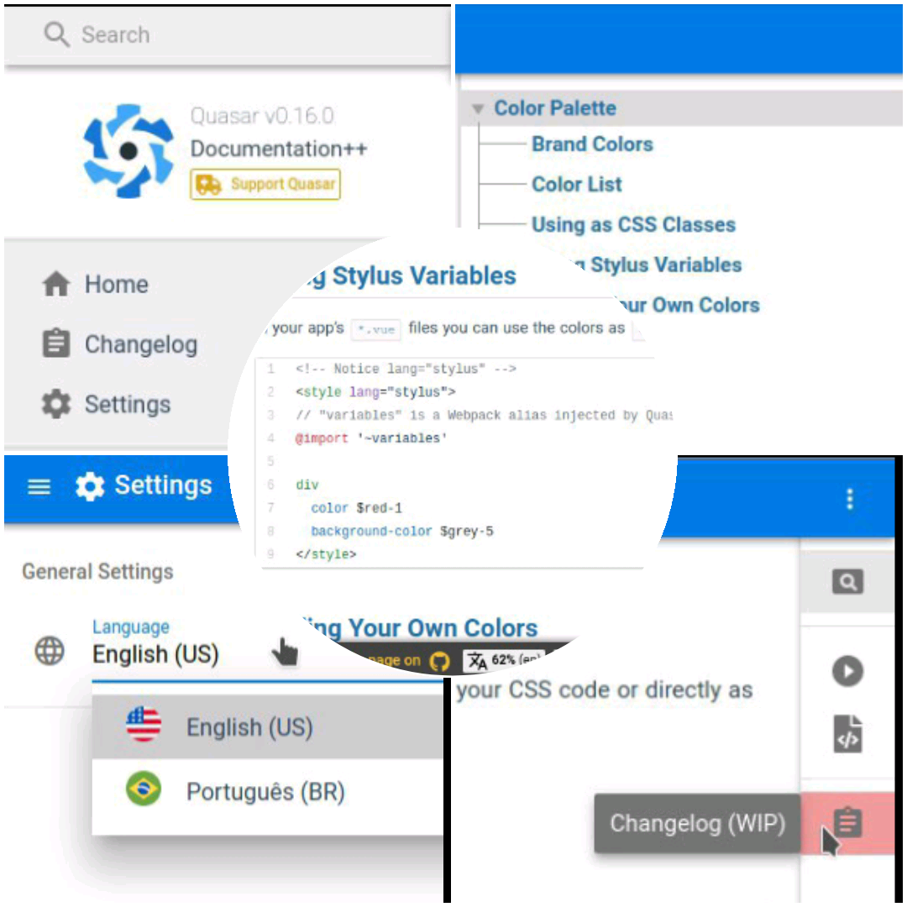

# Quasar Documentation++
(WORKING IN PROGRESS)

> All-in-one Documentation of Quasar Framework.

The proposal of this project is to join in one place, everything of the Quasar Documentation: the theoretical part ([quasar-framework.org](https://quasar-framework.org/ "quasar-framework.org")), showcases ([Quasar Play](https://quasar-framework.org/quasar-play/android/index.html#/showcase "Quasar Play")),  showcases source codes ([from github](https://github.com/quasarframework/quasar-play/tree/dev/src/pages/showcase "from github")) and changelogs.

You can clone this repository, run on a **web server** and have access to everything from the Quasar Framework completely **offline** on your computer!
You can also **compile** for **mobile** and **desktop** devices.

In addition, we have created many features that make it easy to study and search for specific information within the Quasar Documentation++.

Some features of this documentation are listed below!
See the projects tab for more details!

## Features
### Internationalization (i18n)
We want the documentation to be available in any language so that it can reach **everyone**.

Currently available in 2 languages: English (en) and Portuguese (pt).

### Menu search engine based in keywords and i18n (Beta)
The search for content in the documentation is simple, fast and easy.
The search input text in the **menu** makes it easy to search for **any content** using keywords and you can do it in your favorite language.
If the defined language is not English and if the search term is not found or has not been set in current language, by default a search is still performed using keywords in English.

### Documentation codes in local files (Beta)
A JSON file that is processed by the Gist is downloaded and stored in **local files**. These files contain `.vue`, `.js`, `.html`, or `.css` codes that are used in the documentation so that you can access the codes of the documentation **offline**.

### Anchor links navigation (Beta)
Anchor links work in hash and history mode and provide **faster navigation** and **better orientation** when navigating through subsections of documentation.

### Partial Code View in the Showcase (WIP)
...

### Component Builder with Source Code (WIP)
...

## Screenshots

## Contributing
Wait for the CONTRIBUTING.md file to initiate a contribution to this repository.

## Donate
Bitcoin:

13YRbtrnXerWNpmXsh33AjPMPyq52kqVAx

Ethereum:

0x9906f187a174ff89fe9adce75be4bfb3fdd600c6

Nano:

nano_1beny7hmi4be8yogbyb6esusqto851jibetr8rh7cjcgo39ymwzupazi89y4

## License
Copyright (c) 2018-Present - Rodrigo Vieira (Slowaways)

[MIT License](http://en.wikipedia.org/wiki/MIT_License)
