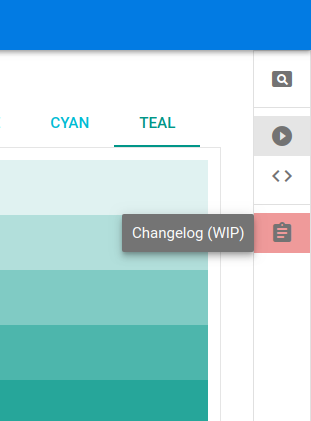

# Quasar Documentation++
(WORKING IN PROGRESS)

> All-in-one Documentation of Quasar Framework.

The proposal of this project is to join in one place, all the documentation of the Quasar Framework: the theoretical part ([quasar-framework.org](https://quasar-framework.org/ "quasar-framework.org")), showcases ([Quasar Play](https://quasar-framework.org/quasar-play/android/index.html#/showcase "Quasar Play")),  showcases source codes ([from github](https://github.com/quasarframework/quasar-play/tree/dev/src/pages/showcase "from github")) and changelogs.

You can clone this repository and run on a **web server**, all the documentation of Quasar Framework completely **offline** on your computer, and also **compile** for **mobile** and **desktop** devices.

In addition, we have created several features that make it easy to study and search for specific information within the Quasar Documentation++.

Some features of this documentation are listed below!
See the projects tab for more details!

## Features
### Internationalization (i18n)
We want the documentation to be available in any language so that it can reach **everyone**.

Currently available in 2 languages: English (en) and Portuguese (pt).
Wait for the CONTRIBUTING.md file to initiate a contribution to this repository.

### Menu search engine based in keywords and i18n
The search for content in the documentation is simple, fast and easy.
The search input text in the **menu** makes it easy to search for **any content** using keywords and you can do it in your favorite language.

### Documentation codes in local files
A JSON file that is processed by the Gist is downloaded and stored in **local files**. These files contain `.vue`, `.js`, `.html`, or `.css` codes that are used in the documentation so that you can access all of the documentation **offline**.

### Anchor links navigation
Anchor links work in both hash and history mode and provide **faster navigation** and better **orientation** when navigating through subsections of documentation.

### Partial Code View in the Showcase (WIP)
...

### Component Builder with Source Code (WIP)
...

## Screenshots

(Coming soon) Individual Changelog

## Contributing
Wait for the CONTRIBUTING.md file to initiate a contribution to this repository.

## License
Copyright (c) 2018 - Rodrigo Vieira (Slowaways)

[MIT License](http://en.wikipedia.org/wiki/MIT_License)
